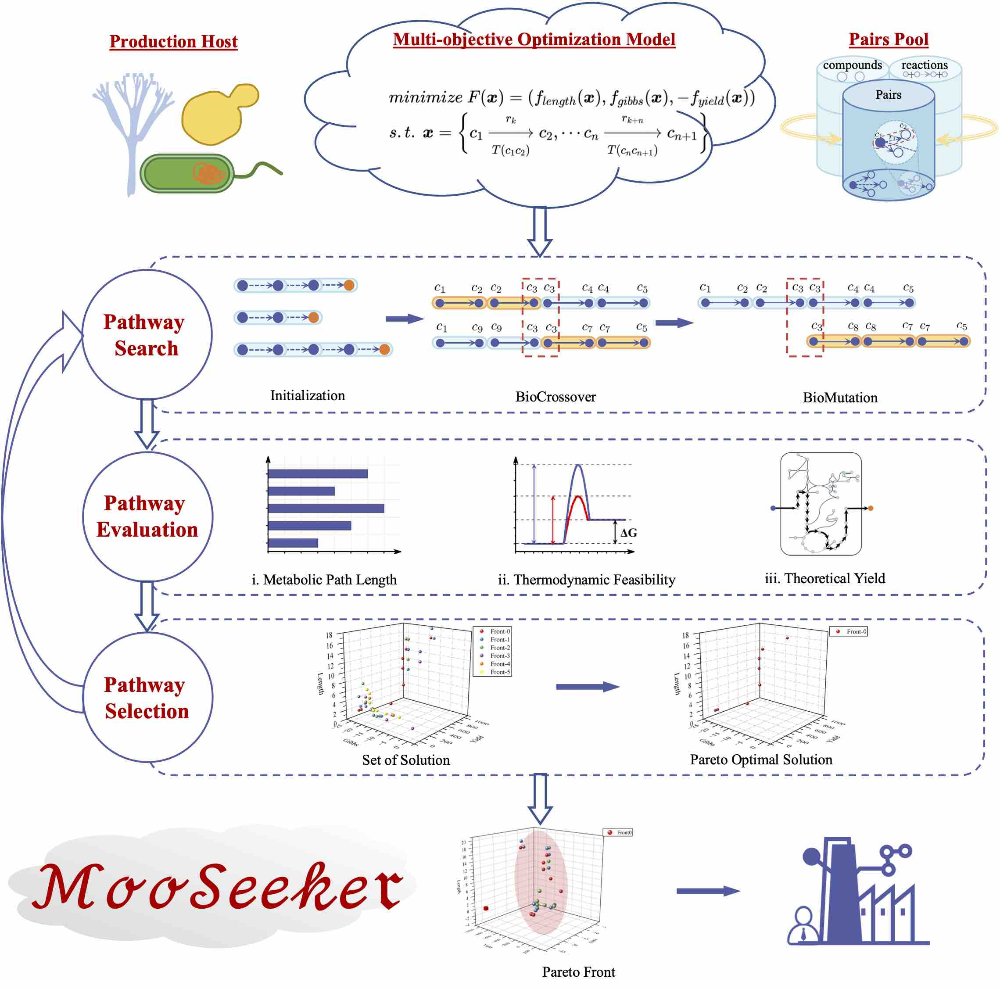

<!--
 * @Autor: caoyh
 * @Date: 2022-11-17 09:27:27
 * @LastEditTime: 2022-11-20 11:42:14
-->
# MooSeeker

## Introduction
MooSeeker is a metabolic pathway design tool based on the multi-objective optimization algorithm that aims to trade off all the criteria optimally. 

- The metabolic pathway design problem is characterized as a multi-objective optimization problem with three objectives including pathway length, thermodynamic feasibility and theoretical yield. 
- In order to digitize the continuous metabolic pathway, MooSeeker develops the encoding strategy, BioCrossover and BioMutation operators to search for the candidate pathways. 
- Finally, MooSeeker outputs the Pareto optimal solutions of the candidate metabolic pathways with three criterion values.

The experiment results show that MooSeeker is capable of constructing the experimentally validated pathways and finding the higher-performance pathway than the single-objective-based methods. 



---

## Methodology
MooSeeker is proposed for design metabolic pathway with 3 stages:

> **KEGG database**:
> The KEGG database is an open access database that can download through [KEGG API](https://www.kegg.jp/kegg/rest/keggapi.html).
We provide `kegg_helper/kegg.py` to get necessary information from KEGG.

### 1. Initilize Pairs Pool based on the KEGG Database 

```bash
python utils/init_pool.py
```
### 2. Improved NSGA-II algorithm for Metabolic Pathway 
The improved NSGA-II algorithm based on the **encoding strategy**, **BioCrossover** and **BioMutation** operators is shown in `model/BiOperators.py`. 

### 3. Train the model 
According to different experiment, there are four types of config file for `multi_glycolysis.yaml`, `multi_vanillin.yaml`, `single_glycolysis.yaml`, `single_vanillin.yaml`. 

We can train the model based on different config file for different result.

For example:
```bash
python main.py --algorithm multi --production vanillin
```
Here, 
- `--algorithm` sets the multi- or single- algorithm for metabolic pathway design.
- `--production` sets the glycoly or vanillin production for metabolic pathway design.

The experimental results are saved into the `cache/result_*`. 

### 4. Analysis the result

## Reference

[1] Yahui Cao, Tao Zhang, Xin Zhao, el. MooSeeker
